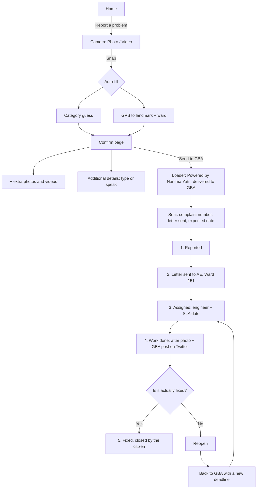

# Nodi: frictionless civic complaints for Bengaluru

Namma Yatri Product Design Assignment (A). Prototype: `/` in this project. This write-up: `/case-study`.

## Summary

Nodi (ನೋಡಿ, Kannada for "look") is a Namma Yatri app for reporting a broken civic thing the moment you see it and watching it get fixed. You look, you snap, and the city has to look too. Reporting is one photo plus one confirm page: the app fills in the category, location and ward for you, and more photos, videos or a spoken note are one tap away. Tracking works like a food delivery tracker, with five plain-language stages. The part I care most about is trust. Every complaint gets a formal letter to the ward engineer, GBA's own post about the work, shown exactly as it looks on Twitter, and only the citizen can mark a complaint as fixed. The whole flow is designed so a 68-year-old who reads Kannada and dislikes typing can finish it as easily as a 29-year-old commuter.

## The problem, and what research told me

The brief says existing civic apps are slow, confusing and opaque. Desk research on Bengaluru backs that up, and points at one failure bigger than the rest: people stop believing the status.

- **Complaints get closed without being fixed.** The Times of India reported that BBMP Sahaaya 2.0 marks complaints as resolved without action ([TOI, Nov 2024](https://timesofindia.indiatimes.com/articleshow/115392024.cms)). An earlier snapshot counted about 1.7 lakh complaints with about 5,900 still unresolved ([TOI](https://timesofindia.indiatimes.com/articleshow/87321254.cms)).
- **Escalation is noise to citizens.** One r/bangalore thread describes 23 days and six escalation SMSes (AE to AEE to EE to SE) with nothing fixed ([Reddit](https://www.reddit.com/r/bangalore/comments/rvouyn/)). Another calls the app "a big SCAM" ([Reddit](https://www.reddit.com/r/bangalore/comments/1s2gkoe/)). A counter-signal matters too: one person who raised about 50 pothole complaints in a year says most were resolved ([Reddit](https://www.reddit.com/r/bangalore/comments/1h3y0a8/)). Persistence works. The system just hides that from you.
- **The current app is hard to use.** The Namma Bengaluru app, which now hosts Sahaaya, sits at 2.0 stars on the App Store. The top complaint is that there is no back button ([App Store](https://apps.apple.com/in/app/namma-bengaluru/id6755224744)).
- **The authority changed, the name didn't.** BBMP was dissolved and the Greater Bengaluru Authority (GBA) with five city corporations took over from September 2025 ([The Hindu](https://www.thehindu.com/news/cities/bangalore/more-wards-same-workforce-gba-corporations-struggle-to-deliver-on-the-ground)). People still say "BBMP", so Nodi accepts both words in search and voice.
- **Officials already post proof on X.** @GBA_office posts photos of pothole repair work ([x.com/GBA_office](https://x.com/GBA_office)). The BWSSB chairman's account asks citizens to tweet because app tickets "seem useless". Citizens also call out staged photos as eyewash ([example](https://x.com/ChristinMP_/status/1851480269359923241)). So X proof helps, but it can't be the only proof.
- **Elders need voice, big type and fewer choices.** A systematic review of app design for older adults points to voice, text-to-speech and task simplification ([PMC](https://pmc.ncbi.nlm.nih.gov/articles/PMC12350549)). Work on WhatsApp use in South Asia shows low-literacy, multilingual users lean on familiar, multimodal interfaces ([ACM SIGACCESS 2024](https://dl.acm.org/doi/10.1145/3663547.3746389)).
- **Namma Yatri has a reason to build this.** It is zero-commission, open source and publishes open data ([nammayatri.in/open](https://nammayatri.in/open)), and it runs on ONDC and Beckn. Its roughly 7.7 lakh drivers ([nammayatri.in](https://nammayatri.in)) spend all day on the roads Nodi is about.

## Who it's for

These are proto-personas built from the research above. I'd validate them in the first round of testing.

| Person | Situation | What they need |
|---|---|---|
| Priya, 29, commuter, Koramangala | Sees a pothole on the way to work and has about 20 seconds. | No forms. Snap, send, get back to her day. |
| Ramesh, 68, retired, Jayanagar | Kannada-first, uses WhatsApp and UPI, reads with glasses, dislikes typing. | To speak instead of type, to see big text, and to know a real person got it. |
| Manjunath, 41, Namma Yatri auto driver (future) | Hits the same potholes every day. | One tap from the driver app, without stopping the ride. |
| Assistant Engineer, GBA ward office (secondary) | Receives complaints from many channels. | Clean, geo-tagged tickets with photos and videos. Out of scope for this prototype. |

## Assumptions and trade-offs

| Assumption | Trade-off I accepted | How I'd reduce the risk |
|---|---|---|
| There is no Sahaaya API on day one. | A Nodi ops team emails a formal letter to the ward engineer and logs the ticket on Sahaaya or 1533 by hand. That costs ops money but lets us launch without waiting on government IT. | Start with one city corporation and push for an API or MoU once the volume makes the case. |
| The user is already signed in through their Namma Yatri account, so there is no login wall. | Easier reporting means more spam risk. | Phone-linked accounts, EXIF and GPS checks on photos, rate limits per person. |
| AI can guess the category from the photo. | It will sometimes guess wrong. | The guess is an editable chip, never a blocker. We track how often people change it. |
| Reports appear on a public map. | Public posting raises privacy concerns. | Reporters are anonymous by default. Faces and number plates are blurred automatically. |
| Officials post work updates on X. | Scraping X is brittle and breaks its terms at scale. | Use the official API or a partner feed, with a person verifying each match. X is proof, not the source of truth. |
| One confirm sheet instead of a multi-step form. | Less room for detail up front. | Smart defaults, plus extra photos, videos and an optional note that can be typed or spoken. |

## Core user flow

1. On Home, tap **Report a problem**, or the yellow camera button in the floating dock.
2. The camera opens straight away, with Photo and Video modes.
3. Snap. In the background, Nodi guesses the category ("Water leak") and turns GPS into a landmark, ward and city corporation.
4. One confirm page, laid out like a details page, shows three sections: what it is and where, photos and videos (a + tile adds more), and optional additional details that can be typed or spoken with a hold-to-talk mic.
5. Tap **Send to GBA**. A short loader shows who is handling it: "Powered by Namma Yatri, delivered to GBA Ward 151", with the real GBA logo.
6. The Sent screen shows the complaint number (NODI-24611), confirms that a formal letter went to the Assistant Engineer for Ward 151, gives the expected fix date from the SLA, and says updates will come on WhatsApp.
7. Tracking moves through five stages: Reported, Letter sent, Assigned, Work done, Fixed.
8. When GBA marks the work done, Nodi shows the after photo and GBA's matching post on Twitter, then asks: "Is it actually fixed?"
9. Yes closes it as Fixed. No reopens it and sends it back to GBA with a new deadline. GBA's post stays on the complaint as a record of what was claimed.

## Screen by screen

What each screen in the prototype is doing, and why. The prototype runs in dark and light mode; the reasons are the same in both.

**01 Home · My reports**
- One job above the fold: "See a problem" flips through road, streetlights, water and footpaths, with a single "Report a problem" button under it. The yellow camera button in the dock does the same thing from anywhere.
- "Check if it's fixed" comes first, with a pulsing dot. Only the citizen can close a complaint, which fixes Sahaaya's fake "Resolved" problem.
- The report cards are compact, and each one shows its status, due date and a thin 5-step progress bar.
- Tapping the profile photo opens your ward, a link to your ward on Sahaaya, and settings: language, bigger text, read aloud, reduce motion and appearance.

**02a Report · Camera first**
- The app opens straight into the camera, so there's no form or category to pick first. Photo and video use the same controls as the iOS Camera app.
- "Only if it's safe to stop" reminds drivers and riders to report safely.

**02b Report · One confirm page**
- The AI and GPS fill in the category, location and ward. The user checks and sends, so there's no step-by-step wizard.
- If the AI guesses wrong, the category is one tap to change. A wrong guess never blocks sending.
- A + tile adds more photos or videos from other angles, and Additional details takes a typed or spoken note. The engineer gets a clearer picture before the site visit.

**02c Trust loader**
- The wait becomes proof. The loader shows three real steps: attached, delivered to the ward, letter emailed.
- The "Powered by Namma Yatri + GBA" line borrows trust from a brand people already use daily.

**02d Sent, with a promise**
- It gives a complaint number, the named office it went to, and an expected fix date based on each category's service deadline.
- The formal letter can be opened and shared. It turns an app tap into an official record.
- Updates go to WhatsApp, where elders already are.

**03 Track · Proof, then you confirm**
- A plain-language headline tells you the status, and a speaker button reads it aloud.
- The before and after photos, plus GBA's matching post shown exactly as it looks on Twitter, are the official proof.
- "Is it actually fixed?" If the answer is no, the complaint reopens and goes back to GBA with a new deadline.
- The timeline follows Citizen's style: stage name, time, one plain sentence. The Reported step shows the photos, videos and voice note you sent, and each one opens in a viewer.

**04 Nearby · What's happening around you**
- Inspired by Citizen: a dark live map where every report shows up as a photo pin. It shows at a glance that people nearby are reporting things too.
- Tapping a pin or row opens an incident sheet. It's read-only: the photo, the stage, and a short timeline of what GBA has done so far.
- "Reported" lists every incident in the ward, newest first: distance and street, title, one line, and when it was last updated.
- "Official updates" shows only GBA's posts on Twitter. Seeing residents report and GBA respond next to each other builds trust.

## Key design decisions

1. **Camera first, questions later.**
   Why: the moment of seeing the problem is the moment of motivation. Every screen before the camera is a place to drop off. The photo also answers most of the questions a form would ask.

2. **One confirm sheet, not a wizard.**
   Why: a four-step form feels like paperwork. One sheet with smart defaults means the typical path is snap, glance, send. Everything on the sheet can be edited, and nothing on it is required.

3. **The category is a guess shown as a chip.**
   Why: people don't think in department names. "Pothole" is shown with a quiet "looks large", and one tap changes it. If the AI is wrong, the user fixes it in a second instead of getting stuck.

4. **More evidence is one tap away.**
   Why: a + tile under the first photo adds other angles or a short video, and Additional details takes a typed or spoken note. The engineer knows what they're walking into before the site visit.

5. **Tracking looks like a delivery tracker.**
   Why: every smartphone user in Bengaluru already reads a Swiggy or Namma Yatri ride tracker without thinking. Five stages in plain words ("Letter sent", not "Forwarded to JE") are easy to read from across a room.

6. **Only the citizen can close a complaint.**
   Why: fake closures are the single biggest reason people stop trusting Sahaaya. Moving the close button to the person who reported it changes the incentive.

7. **A formal letter goes out with every complaint.**
   Why: a named letter to a named engineer, with a date, is something a ward office has to answer. It also gives the citizen a document to point at if things stall.

8. **GBA's own post is the proof, shown as it looks on Twitter.**
   Why: a post from @GBA_office, with the real GBA logo and an Open on Twitter link, is something anyone can check. It's stronger than a status change. It stays on the complaint even after a reopen, and the citizen still has the final word.

9. **One dark system, with a light mode.**
   Why: near-black surfaces (#0D0D0F) and a single yellow accent (#FFB739) keep the app calm, and photo pins stand out on the dark map. Anyone who reads better on white can switch to light mode in Profile.

10. **Nearby is read-only and shows both sides.**
   Why: Reported lists what residents have raised, and Official updates shows only GBA's own posts. Seeing both next to each other shows that reports lead somewhere. There's nothing to do there except read, so it can't turn into a complaints forum.

## Trust system

Trust is the product. Each piece below answers the question "did anyone actually do anything?"

- **Powered-by loader.** When you tap Send, you see who is carrying your complaint: Namma Yatri, then GBA Ward 151, with the real GBA logo. It takes about a second and replaces a spinner with a name.
- **Formal letter.** A PDF letter is emailed to the Assistant Engineer for the ward and the ticket is logged on Sahaaya or 1533. The citizen can open the letter from the timeline.
- **Verified badges.** Official accounts and engineers get a verified check. Tapping it opens a short sheet explaining what verified means and who checked it.
- **GBA's post on Twitter.** When @GBA_office posts about work at that location, the post shows up on the complaint exactly as it looks on Twitter, with Open on Twitter underneath.
- **Citizen-only closure.** Nothing is "Fixed" until the person who reported it says so. If they say it isn't, the complaint reopens and goes back to GBA with a new deadline.
- **Named people and dates.** Every stage shows who owns it and when it's expected. SLAs by type: pothole 3 days, garbage 1 day, streetlight 2 days, water leak 1 day.

## Designing for elders

Ramesh is the person I designed for. If he can do it, Priya can do it faster.

- **Bigger text** in Profile, under Accessibility. One switch scales the whole app.
- **Speak instead of type.** Additional details on the confirm page can be spoken in Kannada, English or Hindi. Hold the mic and Nodi types it out.
- **Listen button** on every status update. The app reads the update aloud, or reads it automatically when a complaint opens if that setting is on.
- **Kannada and English** in Profile. Kannada is set in Anek Kannada so it stays easy to read. Search understands "BBMP" as well as "GBA".
- **Reduce motion** in Profile stops the flipping text and animations.
- **One decision per screen.** Each screen has one obvious primary action. Secondary options are text links.
- **Touch targets of 44pt or more**, following Apple's Human Interface Guidelines, with the main buttons much larger.
- **WhatsApp updates**, because that is where elders already read messages. They don't need to open the app to know what happened.

## MVP and future

| Now (MVP) | Next | Later |
|---|---|---|
| Camera-first report with photo or video | GBA officer console for ward engineers | One-tap pothole reporting from the Namma Yatri driver app, then accelerometer detection |
| AI category guess and GPS-to-ward routing | Automatic sync with Sahaaya and the X API | WhatsApp bot and IVR reporting for feature phones |
| Extra photos, videos and a typed or spoken note | Duplicate detection, so one pothole is one ticket | RTI letter generator for complaints that stall |
| Five-stage tracker with named owners and dates | Alerts for new reports in your ward | Routing to BESCOM and BWSSB |
| Automatic formal letter to the ward engineer | Offline queue for poor network | Public open-data API, in line with Namma Yatri's open data |
| WhatsApp and push updates | | |
| Citizen confirm, reopen sends it back to GBA | | |
| Nearby map of reported incidents and GBA posts | | |
| Kannada and English, bigger text, read aloud, light and dark | | |
| Verified badges and GBA posts matched by ops | | |

## How I'd measure success

All targets below are my starting goals for a pilot, not measured numbers. I'd reset them after the first month of real data.

**North star: citizen-verified resolutions per week.** It only moves when a problem is reported, routed, fixed and confirmed by the person who saw it, so no single team can game it.

**Reporting funnel**
- Camera opened to report submitted: 80% or more.
- Median time from tapping Report to Send: under 30 seconds.
- AI category accepted without edits: 85% or more.
- Completion rate for users aged 60+ roughly equal to users under 40.

**Outcomes**
- Share of complaints fixed within SLA.
- Median days to fix, by category.
- Reopen rate. It should be visible early (it means we're catching fake closures) and then trend down.
- Closures backed by official proof: 70% or more.
- Satisfaction rating after a fix.

**Trust and engagement**
- Share of reports with extra photos or videos.
- People who file a second report within 60 days.
- Open rate of WhatsApp status updates.

**Business, for Namma Yatri**
- Nodi users who install or open the Namma Yatri app.
- Brand trust and NPS in Bengaluru.
- Cost per complaint compared with a 1533 call.
- A partnership or MoU with GBA, and a shared open-data dashboard.
- Driver engagement once driver reporting launches.
- Pothole data improving ETA and routing for rides.

**Guardrails**
- Share of spam or false reports.
- Duplicate tickets that slip through.
- Privacy incidents, such as an unblurred face or number plate.
- Authority SLA breach rate. If this climbs, citizens stop trusting the dates we show.

## Risks and open questions

- **Will GBA engage?** Without a partner inside the authority, Nodi is a very polite complaint forwarder. The letter and X proof work without one, but a pilot MoU with one city corporation would change a lot.
- **The ops cost of the bridge.** Logging tickets by hand and matching X posts doesn't scale forever. I'd need to know how many reports per day one ops person can handle before API work becomes urgent.
- **Staged proof.** An official photo can still be misleading. Citizen confirmation covers this, but it also means we need a clear, calm way to say "not fixed" that doesn't feel like a fight with the government.
- **Spoken notes in mixed languages.** Transcribing Kannada, English and Hindi mixed in one sentence is hard. The engineer may need to hear the audio, not just read the text.
- **Reporters who never come back.** Only the reporter can close a complaint, so some will sit at Work done forever. I'd test a reminder first, then a neutral close with the proof attached.

## What I'd test first

A moderated usability round with 10 people in Bengaluru: 5 people aged 60 or older (at least 3 who prefer Kannada) and 5 daily commuters under 40. Sessions happen on a phone, outdoors where possible, because that's where reports actually happen.

Tasks:
1. Report the pothole in this photo. I'd measure time to Send, where they hesitate, and whether they notice and trust the category guess.
2. You already reported this. Find out what's happening with it. Can they tell which stage it's at and who owns it?
3. The city says it's fixed, but it isn't. What do you do? Do they find "No, not fixed" and understand what happens next?
4. Elders only: do the same report without typing anything, using bigger text and the mic.

What I'd watch for: whether the camera opening straight away feels fast or startling, whether "Letter sent" means anything to people, whether GBA's post on Twitter raises trust or reads as government PR, and whether the Listen button gets used without prompting.

The success bar for round one: at least 8 of 10 people report the pothole without help, and elders finish at close to the same rate as commuters. If elders fall behind, spoken notes and bigger text move ahead of everything else on the roadmap.
